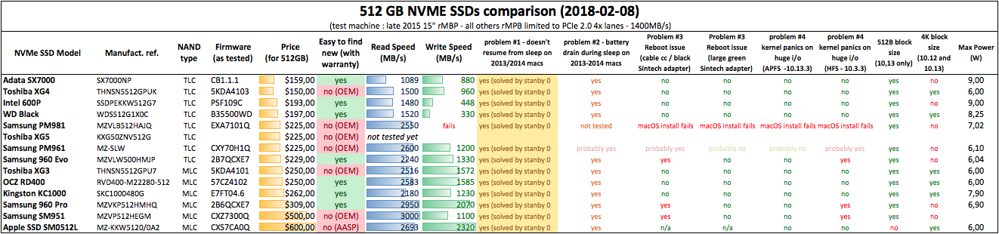
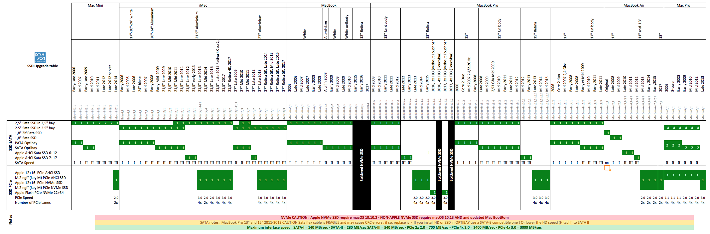

# Macbook NVMe SSD Upgrade

## Why?

Apple used to have relatively super-fast SSDs.
Nowadays we have cheaper, and faster SSDs than Apple,
and we can buy them literally anywhere instead of salvaging or getting one from OWC.

Sometimes we ran out of storage, and getting another Apple SSD is not economically feasible.
And sometimes, we got a broken SSD, and is out of warranty.

## Compabilities

Courtesy of [gilles_polysoft](https://forums.macrumors.com/threads/upgrading-2013-2014-macbook-pro-ssd-to-m-2-nvme.2034976/page-36#post-25795836)

### Adaptors

Known working connectors:

- Sintech Green / Black (long) adaptor
- sznfhk adaptor

## Prerequesites

- Linux Bootable USB
- High Sierra Bootable USB

- Apple 12+14 Pin to M.2 NGFF adaptor
- Few inches of kapton tape
- A M.2 SSD of your choice

- A Macbook Pro (<2016), on High Sierra or later

## Steps

1. (Optional) Make a Time machine Backup
2. Apply Kapton Tape to insulate pins

3. Install new SSD with adaptor
4. Boot with Linux USB, use `fdisk` to make partitions. Type `Linux` is good enough.
5. Boot with High Sierra USB, use Disk Utility to repartition/format disk into APFS with GUID partition table.
6. Restore from Time Machine or fresh install.
